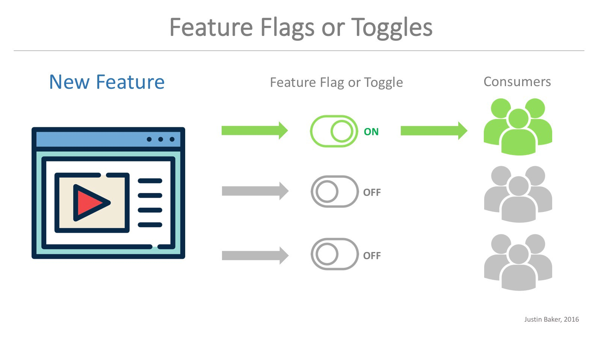

## Câu chuyện ngày xưa

Một buổi sáng thức dậy, những người thợ mỏ họp bàn với nhau rằng hôm nay họ sẽ làm việc trong một căn hầm cũ, bởi chẳng còn nhiều than ở hầm mới nữa. Chuyện chẳng dễ ăn, hầm cũ nhưng có nhiều điều rủi ro hơn căn hầm mới, bởi đã lâu nên khí gas, khí cạc-bon đi-ô-xít và các loại khí độc nặng hơn oxy khác chưa được phát hiện.

Hồi đó công nghệ chạy bằng cơm, không làm thì bụng đói rồi ngỏm, làm thì ngửi khí độc cũng ngỏm.

### Đằng nào cũng ngỏm thì ngỏm theo kiểu FAIL_SAFE

Một chú thợ tên A lên tiếng:

- Em là em đề nghị anh B vô hầm trước, tại ảnh khỏe, chứ cả nhóm đi vô thì chết chùm

Chú B đáp lại:

- Anh đồng ý vế sau, còn vế trước anh không đồng ý. Sự ra đi của anh sẽ là sự tổn thất lớn cho gia đình và xã hội hơn sự ra đi của chú em.

Thế là hai chú oánh nhau túi bụi vì không chú nào chịu hy sinh. Một bước đi vạn dặm đau.

### Đằng nào cũng ngỏm thì ...

Chú C vốn là kỹ sư tài năng của đại học CMU, trên thông thiên văn, dưới tường địa lý phát biểu:

- Tìm ra rồi! đưa chim hoàng yến vào kiểm tra trước.

Thế là cả nhóm đi ra chợ mua chim hoàng yến.

Chiều hôm ấy, hoàng yến bước vào hầm than, hót vang một góc trời, anh em thợ ôm nhau cười sung sướng.

## Câu chuyện ngày nay

Chuyện **hoàng yến trong hầm than** nói về những rủi ro khi triển khai công việc mới. Không riêng gì ngành đào mỏ hay chế biến cá nóc, ngành mới như kỹ thuật phần mềm cũng sẽ có lúc trải qua rủi ro kiểu:

- tính năng mới ngon mà user chửi quá trời
- sao cái-lỗi-đó đi từ development-testing-staging mà không lòi ra

Mình đoán anh em phát triển tính năng đó bị chửi mà vẫn nhiều khi không biết tại sao.

Giữa những bộn bề lo toan, cùng lắm anh em chăm viết test hơn một chút chứ bắt anh em phải suy nghĩ về tính nóng lạnh thất thường của end user là quá sức chịu đựng.

May mà có [17 ông thần](https://agilemanifesto.org/) nghĩ ra một quy trình phát triển phần mềm mới, trong đó có bài toán **Continuous Delivery** nan giải với những triết lý bình dị mà mình sẽ từ từ viết tiếp trong series. Ở đây chúng ta sẽ nói về công cụ feature flags để thực hiện Canary Release.

## Canary Release (CR) là vầy

_a photo by Kaikara Dharma on unsplash_

Release thì anh em dev quen rồi, canary thì là con chim hoàng yến mình nói phía trên. Đại loại CR là hành động launch một phiên bản mới mà anh em đã test tất tần tật rồi anh em muốn đưa nó lên trên production cho user chơi bời nhưng không muốn tất cả user đều chứng kiến sự thay đổi đó.

Anh em muốn thăm dò trước tính năng với một vài kiểu users theo độ tuổi, văn hóa hay vùng địa lý. Khi tính năng được phản hồi tích cực, anh em tà tà triển khai thêm (incremental rollout). Lỡ tính năng bị chê bai thì anh em rút lại (rollback) và khảo sát ý kiến phản hồi.

Ví dụ:

- Google hay triển khai phiên bản mới của Chrome gọi là "Chrome Canary"
- Facebook cũng thử tính năng "Dating" cho các anh em chưa in-a-relationship trước, hay có đợt Việt Nam được thử nghiệm giao diện mới trước

Điểm yếu là anh em phải tốn xiền nuôi chim (devops), lựa hang (user), xử lý MQ hay DB migration chua lè, làm các việc anh em căm phẫn như phân tích thống kê báo cáo. Mình chỉ khuyên khi product lớn mạnh, anh em chuẩn hóa từ đầu đến bước cuối cùng là release thì hãy apply.

Điểm mạnh là anh em có mức độ tự tin cao hơn khi release, tập user có phản hồi tích cực sẽ tăng lên là thứ mà các anh em bỏ tiền cũng không dễ kiếm.

> 1:star: trên AppStore liệu có dễ quên

Tiếp theo là một trong nhiều cách thực hiện. Các anh em có thể thiết kế các hệ thống cloud orchestration như Kubernetes (K8s), có thể dùng router/load balancer hoặc chơi chiêu feature flags.

## Về feature flags hay feature toggles/controls

Như đã nói, chúng ta có nhiều cách thực hiện chuyện CR nhưng vì một số lý do như

- super legacy code smell apps mà không chịu refactor
- outsourcing :D

khiến anh em phải dấn thân vào feature flags. Nếu có điều kiện và thời cơ chín muồi, chúng ta nên phân tách thành microservices sẽ xử lý bài toán mượt mà hơn.

Flags thì anh hiểu là true/false, toggles thì on/off. Nghĩa là các tiền bối khuyên chúng ta thực hiện quản lý feature bằng giá trị BOOLEAN cho dễ nhớ.

Để dễ hình dung mời anh em xem hình sau

[source @justindesign](https://hackernoon.com/feature-flag-driven-releases-7a7a5fee6ba7)

Feature flags/toggles giúp mình có một cơ chế để "pending" một vài tính năng. VD bây giờ các anh em vẫn đang chia sẻ dev cookie để unlock phim Netflix chưa tới ngày chưa publish.

Ngoài việc hỗ trợ CR, feature flags còn hỗ trợ một số yêu cầu

**code chưa xong module chính nhưng vẫn muốn commit**

Anh em hẳn từng trải qua cảm giác bị conflict code vì ráng chờ 5 tuần để release. Agile nó bắt các anh em phải commit để deploy liên tục đó.

**hệ thống quá tải, yêu cầu tắt ngay vài tính năng không quan trọng nhưng tốn tài nguyên**

Cái này thực tế hơn. Anh em làm việc cho đại gia giàu có hay bật autoscaling, chứ thử chơi với con nhà nghèo anh em sẽ phải biết đóng hết những thứ không quan trọng đi.

Giải pháp có sẵn là [LaunchDarkly](https://launchdarkly.com/), còn nếu thích tìm tòi thì [đây](https://featureflags.io/feature-flags/), thư viện sẵn cho Android, Go, Java, Javascript, iOS, .Net, Node, PHP, Python, Rails.

## Lời cuối

Hy vọng các anh em hiểu sơ được feature flags và có bức tranh cơ bản về continuous delivery. Đây là kỹ thuật đơn giản, nhiều lúc chúng ta cần biết để chỉ mặt gọi tên.

## Tham khảo thêm

- [Canary Release - Martin Fowler](https://martinfowler.com/bliki/CanaryRelease.html)
- [Featureflags.io](https://featureflags.io/feature-flags/)
- [Wiki - Introduction to Feature Toggles and Continuous Delivery](https://en.wikipedia.org/wiki/Feature_toggle)
