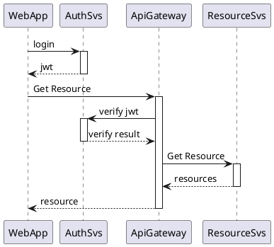

Bằng bất kỳ lý do gì đó mà bạn tìm trên Google với từ khoá như "cách hiện thực JWT" hoặc "JWT trong go" thì đây là bài viết dành cho bạn, mình sẽ không nói dông dài lý do vì sao bạn cần JWT thay vì session vì bạn có thể tìm thấy nó tại: [Why do we Need the JSON Web Token (JWT) in the Modern Web Era?](https://hackernoon.com/why-do-we-need-the-json-web-token-jwt-in-the-modern-web-k29l3sfd?utm_source=12bit.vn).

## Mô hình

Chúng ta sẽ có một mô hình như dưới đây:

Ở đây chúng ta sẽ hiện thực chủ yếu là các phương thức CreateJwt và verifỵJwt ở AuthSvs.
