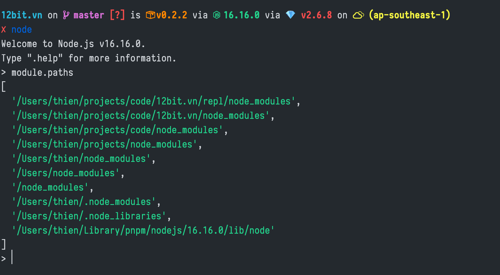

---
authors:
  - tatthien
date: 2022-08-15T11:33:57+07:00
draft: false
title: "Chuyện gì xảy ra khi bạn require('x') trong Node.js?"
tags:
  - node.js
  - short
---

Các bạn chắc hẳn đã biết khi muốn import một package trong node thì chúng ta sẽ dùng `require`.

Khi `require` node sẽ hiểu như sau:

```js
const x = require('x')
```

- Bạn đang import file `x.js`
- Bạn đang import file `x/index.js`

Vậy bạn có biết Node.js sẽ resolve `x` như thế nào không? Thông thường ta biết node sẽ tìm trong `/working-dir/node_modules/x/index.js`.

Tuy nhiên nếu trong `working-dir/node_modules` không có thì sẽ thế nào? Rất đơn giản, chúng ta có thể xem những nơi (path) mà node sẽ dùng để resolve `x` thông qua `module.paths`.



**Ví dụ:**

Nếu trong `/code/12bit.vn/node_modules/x/index.js` không có thì node sẽ tìm tiếp tục trong `/code/node_modules` và cứ thế mà tìm ngược ra. Nếu không tìm được node sẽ báo lỗi `Cannot find module 'x'`.
