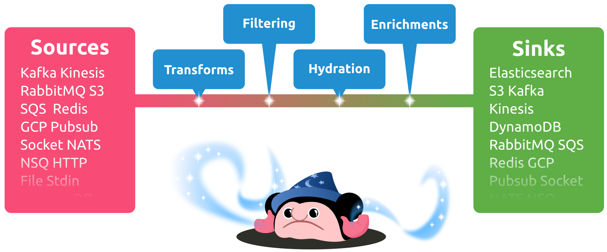

---
authors:
  - vominh
date: "2023-05-19T12:49:07+07:00"
draft: false
tags:
  - bentos
  - log
  - data-pipeline
title: Aggregate log đơn giản bằng Benthos
---

## Motivation

Gần đây, mình có một task đơn giản là tạo sample data để simulate trường hợp nhiều user gửi request lên server. Mình đã viết thành một chương trình khá đơn giản, là loop và tạo record trong database. Cứ mỗi giây sẽ in ra log số record đã lưu được trong 1 giây (op/s) đó, khi chạy ở local với một instance duy nhất thì rất dễ biết tổng số ops. Khi deploy lên k8s, mình muốn tăng số lượng pod lên để stress hơn, nhưng lúc này mình khó có thể đếm được total_ops từ tất cả các pod này.

Cái mình có là log như vầy:

```json
{
  "node": "xxx",
  "ops_per_second": 10,
  "avg_latency_ns": 2
}
{
  "node": "yyy",
  "ops_per_second": 10,
  "avg_latency_ns": 4
}
```

Cái mình muốn:

```json
{
  "total_ops": 20
}
```

## Solution

Để có được kết quả như vậy, mình phải stream, parse được log và lưu lại được giá trị. Cũng không khó để viết một script, tuy nhiên trong quá trình tìm hiểu về xử lý data thì mình có biết tới Bentos.

## Benthos là gì?



Benthos là một data processor, có thể nhận vào data từ nhiều source khá nhau, khả năng xử lý data linh hoạt, mạnh mẽ với bloblang và out ra nhiều dest khác nhau, nhưng lại vô cùng dễ cài đặt vào sử dụng. Có thể chạy trên local với một command đơn giản hoặc auto scale trên k8s hoặc cloud (AWS Lambda).



Mình sẽ có bài giới thiệu chi tiết về Bentos sau. Còn trong bài này mình sẽ chỉ sử dụng nó trong một usecase đơn giản để làm quen: Sử dụng stdin như là input, và trả về metric dưới dạn prometheus.

## Cài đặt

Cách đơn giản nhất là dùng script:

```bash
curl -Lsf https://sh.benthos.dev | bash
```

hoặc Docker:

```bash
docker pull jeffail/benthos
docker run --rm -v /path/to/your/config.yaml:/benthos.yaml jeffail/benthos
```

hoặc Homebrew:

```bash
brew install benthos
```

## Config

Chúng ta cần define 2 thành phần:

1. Input
2. Processor

### Input

Input ta có là log của các pod trên k8s, sử dụng kubeclt để stream log từ các pod có label mà ta chỉnh định.

```bash
kubectl logs -l app=my-app -f
```

Ta có thể dùng pipeline để đưa input đó cho benthos:

```bash
kubectl logs -l app=my-app -f | benthos -c config.yaml
```

Nhưng cũng có thể chạy command kubectl này trong chính benthos bằng kiểu input: [subprocess](https://www.benthos.dev/docs/components/processors/subprocess/):

```yaml
input:
  subprocess:
    name: "kubectl"
    args:
      - "logs"
      - "-l"
      - "app=my-app-app"
      - "-f"
      - "--max-log-requests"
      - "100"
```

Xong bước này, bạn có thể chạy command sau để nhận log stream:

```bash
benthos -c benthos.yaml
```

example output:

```log
INFO Running main config from specified file       @service=benthos path=./benthos.yaml
INFO Listening for HTTP requests at: http://0.0.0.0:4195  @service=benthos
INFO Launching a benthos instance, use CTRL+C to close  @service=benthos
{"node": "my-app-7b9bd88d65-xrvfc" ,"ops_per_second": 0, "avg_latency_ms": 0}
{"node": "my-app-7b9bd88d65-flqx7" ,"ops_per_second": 1, "avg_latency_ms": 1000}
{"node": "my-app-7b9bd88d65-6gt9t" ,"ops_per_second": 7, "avg_latency_ms": 142}
{"node": "my-app-7b9bd88d65-hjtcj" ,"ops_per_second": 0, "avg_latency_ms": 0}
```

### Aggregate

Giờ cần phải collect lại các field `ops_per_second` và `avg_latency_ms` cũng như count `total_op`, Rất may Benthos hỗ trợ [component](https://www.benthos.dev/docs/components/metrics/about) để collect các metric:

```yaml
pipeline:
  processors:
    - metric:
        name: total_ops
        type: counter_by
        value: ${!json("ops_per_second")}
```

Trong có `counter_by` sẽ tăng giá trị của counter dựa trên giá trị lấy được từ `value`.

```bash
benthos -c benthos.yaml
```

Metric không show ra trong output mà sẽ show to page: http://0.0.0.0:4195/metrics

```
...
total_ops{label="",path="root.pipeline.processors.0"} 348
...
```

Vậy ta có tổng số ops đã được tạo.

## Kết

Tuy nhiên cách này chỉ cho số liệu một cách gần đúng thôi, vì nó chỉ pull log message từ lúc benthos được chạy chứ không phải từ lúc pod được tạo. Tuy nhiên nó đáp ứng được nhu cầu đơn giản của mình, mặc dù có thể cải thiện bằng cách deploy benthos thành một service, chạy liên tục, cache metric vào database, và tự động refresh khi pod thay đổi. Chúng ta có thể sẽ quay lại vấn đề này trong tương lai.
