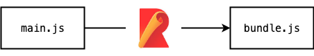
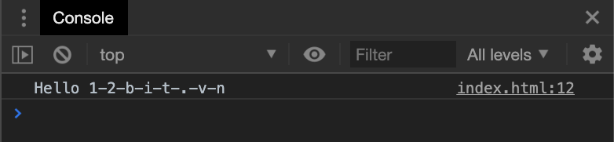



TL;DR

## 1. Giới thiệu

Có lẽ chúng ta đã rất quen thuộc với Webpack - một module bundler được dùng rất nhiều trong việc xây dựng JavaScript application. **Rollup** cũng vậy, nó là một module bundler dành cho JavaScript. Có tác dụng đóng gói những phần code nhỏ thành một gói. Bạn có thể xem hình minh họa bên dưới để hiểu bản chất của module bundler.



## 2. Cài đặt

### Global

```bash
$ npm install -g rollup
```

Sau khi cài đặt, các bạn có thể gõ `rollup --help` trên command-line để xem những option, parameter mà `rollup` hỗ trợ.

Bây giờ chúng ta sẽ bundle thử một ví dụ nhỏ sau để xem cách Rollup hoặc động.



<div class="filename">main.js</div>

```javascript
const hello = function(name) {
  return 'Hello ' + name
};

export default hello;
```

Đoạn code trên sẽ export một function `hello`, trả về kết quả là `Hello [name]`.

Chúng ta sẽ build thử với Rollup.

```bash
$ rollup main.js --file bundle.js --format iife --name hello
```

Sau khi build, file `bundle.js` của chúng ta sẽ như sau:

<div class="filename">bundle.js</div>

```javascript
var hello = (function() {
  'use strict';

  const hello = function(name) {
    return 'Hello ' + name
  };

  return hello;
})();
```

Mình sẽ include file `bundle.js` và gọi function `hello('12bit.vn')`

<div class="filename">index.html</div>

```html
...
<script src="./bundle.js"></script>
<script>
  console.log(hello('12bit.vn'))
</script>
...
```

Kết quả console trên trình duyệt đã output `Hello 12bit.vn`



Và đương nhiên nếu bạn include `main.js` thì trình duyệt sẽ báo lỗi, vì nó không hiểu được `export`.



### Local

Trong trường hợp bạn không muốn dùng command `rollup` global, thì có thể cài local và chỉ sử dụng được trong scope của project.

```bash
$ npm install rollup --save-dev
# hoặc dùng yarn
$ yarn add rollup -D
```

Sau khi cài đặt thì bạn có thể sử dụng giống như global. Nhưng lúc này bạn phải khai báo Rollup trong npm scripts hoặc dùng lệnh [npx](/references/npx):

```bash
$ npx rollup -h
```

## 3. Rollup format

Rollup hỗ trợ chung ta bundle code lại với nhiều format như: **amd, cjs, esm, iife, umd**. Đây chính là sức mạnh để Rollup được dùng trong việc build library có thể chạy trên nhiều môi trường như Node.js, browser, ES.

Như ví dụ trên, mình đã bundle code lại với format là [iife](/articles/tim-hieu-ve-immediately-invoked-function-expression-iife-trong-javascript/) để có thể chạy trên môi trường browser.

Để bundle code với những format khác nhau, các bạn có thể dùng flag

`--format [format]`

```bash
# build library dùng trên browser.
$ rollup --main --file bundle.js --format iife

# build library dùng trong môi trường Node.js
$ rollup --main --file bundle.js --format cjs
```

Để hiểu về các formats: amd, cjs, esm, iife, umd. Bạn có thể đọc bài viết [JAVASCRIPT: What the heck are CJS, AMD, UMD, and ESM?](https://dev.to/iggredible/what-the-heck-are-cjs-amd-umd-and-esm-ikm) trên dev.to

## 4. Rollup plugin

Việc một bundler hỗ trợ plugin đã điều rất cần thiết, vì một bundler không thể nào tích hợp tất cả mọi thứ dạng **built-in** được và cũng không phải ai cũng muốn dùng những tính năng giống nhau. Vì vậy việc dùng plugin sẽ rất linh hoạt và có khả năng mở rộng đối với những app / library phức tạp.

Rollup hỗ trợ rất nhiều plugins ví dụ như transpile ES6/7 -> ES5, compile CSS preprocessor, minify JS,...

Mình sẽ lấy một ví dụ sử dụng plugin [rollup-plugin-babel](https://github.com/rollup/rollup-plugin-babel) để chuyển đổi code JS dạng ES6 thành ES5.

Chúng ta tiếp tục sử dụng ví dụ đầu tiên. Nhưng bây giờ trong file `main.js` sẽ được viết lại một chút, sử dụng [spead syntax trong ES6](/articles/spread-operator-trong-es6/)

```js
const helloWithSpread = name => `Hello ${[...name].join('-')}`

export default helloWithSpread;
```

Nếu chưa dùng plugin để transpile ES6 -> ES5, thì file `bundle.js` sau khi build sẽ như sau:

```js
var helloWithSpread = (function () {
	'use strict';

	const helloWithSpread = name => `Hello ${[...name].join('-')}`;

	return helloWithSpread;
}());
```

Bạn thấy đó! code vẫn vậy, điều này sẽ khiến cho những trình duyệt không [hỗ trợ spread syntax](https://developer.mozilla.org/en-US/docs/Web/JavaScript/Reference/Operators/Spread_syntax#Browser_compatibility) báo lỗi. Chúng ta sẽ sửa lại bằng cách cài thêm plugin babel.

```
$ yarn add -D rollup-plugin-babel@latest @babel/core @babel/preset-env
{}
Chúng ta cần phải cài thêm @babel/core và @babel/preset-env thì plugin mới hoạt động được.
{}

## 5. File config

Khi đã dùng plugin, chúng ta cần phải khai báo plugin trong file config riêng cho Rollup (cũng giống như `webpack.config.js` vậy).

Các bạn sẽ tạo một file tên là `rollup.config.js`, với nội dung như sau:

<div class="filename">rollup.config.js</div>

```js
import babel from 'rollup-plugin-babel'

export default {
  input: 'main.js',
  output: {
    file: 'bundle.js',
    name: 'helloWithSpread',
    format: 'iife'
  },
  plugins: [
    babel({
      exclude: 'node_modules/**'
    })
  ]
}
```

Đơn giản phải không nào! Tiếp theo các bạn khai báo script trong `package.json`

```json
...
"scripts": {
  "build": "rollup --config"
},
...
```

Rollup sẽ tự động detect file `rollup.config.js` trong root folder nếu bạn không truyền đường dẫn tới file config cho `--config`.

Trường hợp bạn muốn dùng nhiều file config cho những ngữ cảnh khác nhau thì có thể khai báo như sau:

```json
...
"scripts": {
  "build:es": "rollup --config path/to/rollup.config.es.js",
  "build:iife": "rollup --config path/to/rollup.config.iife.js",
  "build:umd": "rollup --config path/to/rollup.config.umd.js"
},
...
```

Sau khi build với plugin babel. Chúng ta sẽ được file `bundle.js` như sau:

```js
var helloWithSpread = (function () {
  'use strict';

  function _toConsumableArray(arr) {
    return _arrayWithoutHoles(arr) || _iterableToArray(arr) || _nonIterableSpread();
  }

  function _arrayWithoutHoles(arr) {
    if (Array.isArray(arr)) {
      for (var i = 0, arr2 = new Array(arr.length); i < arr.length; i++) arr2[i] = arr[i];

      return arr2;
    }
  }

  function _iterableToArray(iter) {
    if (Symbol.iterator in Object(iter) || Object.prototype.toString.call(iter) === "[object Arguments]") return Array.from(iter);
  }

  function _nonIterableSpread() {
    throw new TypeError("Invalid attempt to spread non-iterable instance");
  }

  var helloWithSpread = function helloWithSpread(name) {
    return "Hello ".concat(_toConsumableArray(name).join('-'));
  };

  return helloWithSpread;

}());
```

_nhìn thấy code sau khi bundle, mình nhận ra JavaScript như một vũ trụ bao la_ :joy:

Và kết quả trong console của trình duyệt:

```html
<script type="text/javascript">
  console.log(helloWithSpread('12bit.vn'))
</script>
```



## 6. Viết thư viện

Sau khi đã tìm hiểu khái quát về Rollup như command-line, file config, format, plugin. Chúng ta sẽ áp dụng Rollup để build một thư viện nhỏ có chức năng là đảo ngược text. Mình đặt tên thư viện là `reeverse` (thêm dư 1 chữ `e` để tránh bị trùng tên khi release package lên npm).

Mặc dù chưa code gì hết, nhưng mình hình dung ra cách mà chúng ta sẽ sử dụng thư viện như sau:

<div class="filename">reeverse-test/index.js</div>

```javascript
const reverse = require('reeverse')

console.log(reverse('12bit.vn'))
```

```bash
$ node index.js
nv.tib21
```

Ok! bắt đầu code.

### Khởi tạo project

Cấu trúc folder của chúng ta sẽ đơn giản như bên dưới:

```bash
├── index.js
├── package.json
├── rollup.config.js
```

### Cài đặt package

Các package mình sẽ cài đặt như sau:

```
$ yarn add -D rollup rollup-plugin-babel rollup-plugin-terser @babel/core @babel/preset-env
```

Các bạn sẽ thấy có thêm một plugin là `rollup-plugin-terser` có tác dụng minify JS.

### Cấu hình file config

Tiếp theo, chúng ta khai báo nội dung cho `rollup.config.js`

<div class="filename">rollup.config.js</div>

```js
import babel from 'rollup-plugin-babel';
import { terser } from 'rollup-plugin-terser';

export default {
  input: 'index.js',
  output: [
    {
      // Build cho trình duyệt.
      name: 'reeverse',
      file: 'dist/reeverse.min.js',
      format: 'iife',
    },
    {
      // Build cho môi trường sử dụng ES modules.
      name: 'reeverse',
      file: 'dist/reeverse.esm.js',
      format: 'es',
    },
    {
      // Build cho môi trường Node.js và trình duyệt.
      name: 'reeverse',
      file: 'dist/reeverse.umd.js',
      format: 'umd',
    },
  ],
  plugins: [
    babel({
      exclude: 'node_modules/**',
    }),
    terser()
  ],
};
```

Như bạn thấy trong file config, mình sẽ build thư viện này cho 3 môi trường. Ngoài ra mình sử dụng thêm `rollup-plugin-terser` để minify output.

### Cấu hình package.json

Ngoài những thuộc tính thông thường như version, description, ..., chúng ta sẽ config một vài thuộc tính đặc biệt sau.

Đầu tiên là script để bundle.

```
"scripts": {
  "build": "rm -rf dist && rollup --config"
}
```

Tiếp theo là định nghĩa các môi trường ứng với file output.

```
"main": "dist/reeverse.umd.js",
"module": "dist/reeverse.esm.js",
"unpkg": "dist/reeverse.min.js",
```

Để hiểu thêm về những thuộc tính trên, các bạn có thể đọc thêm ở bài viết [What's what? - Package.json cheatsheet!](https://areknawo.com/whats-what-package-json-cheatsheet/)

### Viết code

Sau khi đã config xong, chúng ta sẽ viết code cho file `index.js`.

<div class="filename">index.js</div>

```js
const reverse = input =>
  input
    .split('')
    .reverse()
    .join('');

export default reverse;
```

_Có lẽ mình không nên giải thích cách reverse text như thế nào_ :grin:

Tiếp theo, chúng ta sẽ bundle đoạn code trên.

```bash
$ yarn build
```

Và sau khi build, chúng ta sẽ có 3 files mới ứng với 3 môi trường được tạo ra nằm trong folder `dist`.

```bash
├── dist
│   ├── reeverse.esm.js
│   ├── reeverse.min.js
│   └── reeverse.umd.js
```

## 7. Publish lên npm

{}
Để đảm bảo package của chúng ta được cài đặt và sử dụng thành công, các bạn hãy tìm hiểu `npm pack` để xem cách test một package trước khi publish.
{}

Cách publish lên npm cũng đơn giản, bạn chỉ cần login vào npm, sau đó gõ lệnh `npm publish`. Tất cả quá trình được thực hiện thông qua command-line.

```bash
$ npm login
```

```bash
$ cd reeverse
$ npm publish
```

Trong quá trình viết bài này và làm demo, mình cũng đã publish thư viện lên npm: [https://www.npmjs.com/package/reeverse](https://www.npmjs.com/package/reeverse)

Vì đã công khai nên mọi người đều có thể sử dụng thư viện của chúng ta. Cùng xem qua hai ví dụ mình sử dụng `reeverse` trên CodePen và CodeSandbox.

Môi trường browser:



Môi trường modular (Vue.js app):

<iframe src="https://codesandbox.io/embed/12bitvn-demo-for-js-library-reeverse-7vvuo?fontsize=14&hidenavigation=1" title="12bit.vn - demo for JS library &quot;reeverse&quot;" allow="geolocation; microphone; camera; midi; vr; accelerometer; gyroscope; payment; ambient-light-sensor; encrypted-media; usb" style="width:100%; height:500px; border:0; border-radius: 4px; overflow:hidden;" sandbox="allow-modals allow-forms allow-popups allow-scripts allow-same-origin"></iframe>

## 8. Kết luận

Bài viết khá dài, nhưng có vài điều các bạn cần nhớ:

1. Dùng Rollup để bundle code ra sử dụng cho nhiều môi trường. Đây là thế mạnh của Rollup khi build library.
2. Cấu hình Rollup qua file config.
3. Sử dụng Rollup plugin.

Rollup còn rất nhiều tính năng, mình chỉ đi qua một phần nhỏ. Các bạn hãy lên trang chủ của [Rollup](https://rollupjs.org) để tìm hiểu sâu hơn.

Có người hỏi rằng khi nào thì dùng Webpack và khi nào dùng Rollup? Các nhân mình khá đồng ý với quote bên dưới như sau:

> Use webpack for apps, and Rollup for libraries

Nếu bạn muốn build app hãy dùng Webpack, muốn xây dựng thư viện dùng được ở nhiều môi trường hãy dùng Rollup.

## 9. Tham khảo

- [Awesome Rollup](https://github.com/rollup/awesome)
- [What's what? - Package.json cheatsheet!](https://areknawo.com/whats-what-package-json-cheatsheet/)
- [JAVASCRIPT: What the heck are CJS, AMD, UMD, and ESM?](https://dev.to/iggredible/what-the-heck-are-cjs-amd-umd-and-esm-ikm)
- [Testing npm packages before publishing](https://dev.to/vcarl/testing-npm-packages-before-publishing-h7o)
- [Webpack and Rollup: the same but different](https://medium.com/webpack/webpack-and-rollup-the-same-but-different-a41ad427058c)

---

À. Đừng quên star :star: cho project nhé.


