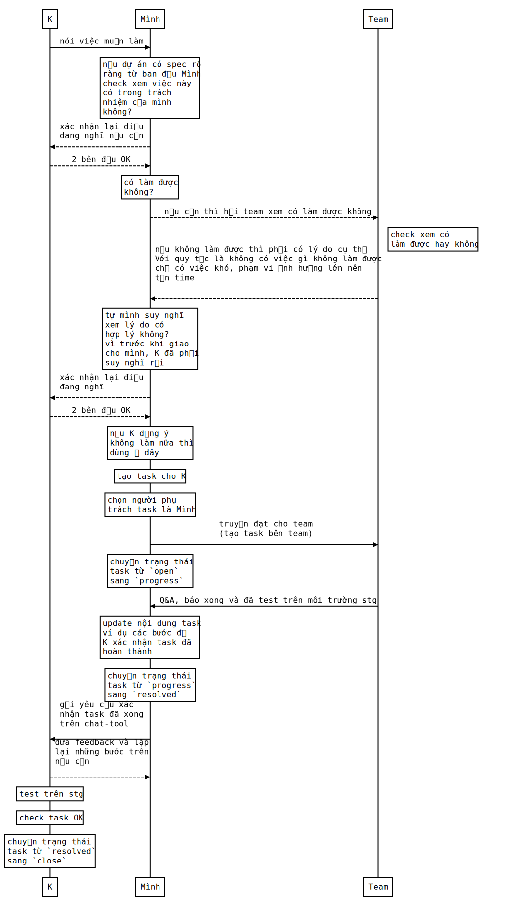
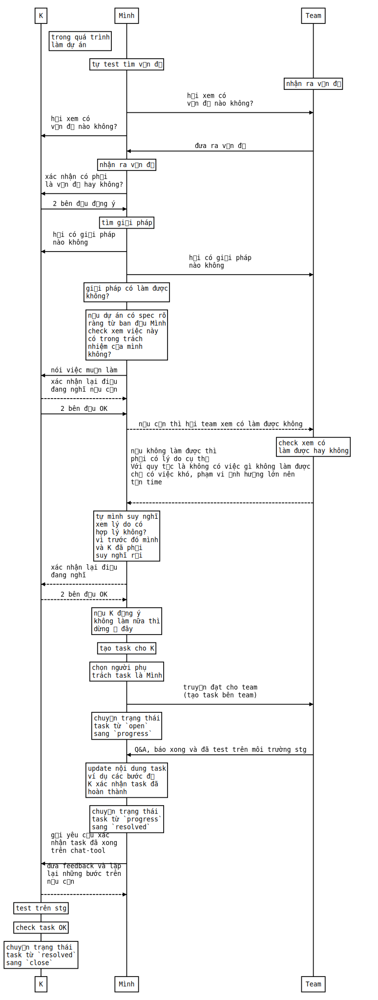

## Mở đầu

Về đặc thù của vị trí `BrSE` bạn có thể `google` để biết thêm. Trong các bài viết đó thì bài viết [Kỹ Sư Cầu Nối Là Gì](https://itviec.com/blog/ky-su-cau-noi-la-gi/) giới thiệu mình thấy khá là dễ hiểu.

Bằng kinh nghiệm làm `BrSE` với dự án đầu tiên ăn hành tỏi thì bài viết chỉ mang tính tự thuật và đem lại cho người ngoài ngành cái nhìn rõ hơn 1 chút về nghề này.

Còn đối với các bạn mới làm `BrSE` thì theo mình nghĩ các bạn nên tự mình trải nghiệm.

Bài viết đưa ra `workflow` của cá nhân mình, nếu nó chưa phù hợp hoặc chưa đúng thì mong các bạn comment để mình học hỏi thêm.

## Workflow là gì?

Dịch sang tiếng Việt thì là `luồng công việc` hoặc `quy trình`.

Các ví dụ về `luồng công việc` như:
- Các bước để tán gái.
- Các bước để hút thuốc lào đúng cách.
- Các bộ phận logic trong 1 cái máy.
- Các quy trình khi sử dụng git với team.
- ...

Workflow cũng có tính tương đối đúng sai và khi sử dụng không nên quá cứng nhắc.

## Workflow để làm gì?

- Tránh gây ra những thiệt hại, sai sót không đáng có khi làm việc. Ví dụ như:
  - Tránh những lý do như `ôi quên mất!`, `xoá nhầm data mà không backup rồi`.
  - Khi có sự cố, những ghi chép trên task, chat tool sẽ giống như sổ ghi log, giúp minh bạch hoá công việc đã làm.
- Giúp quá trình diễn ra dễ tự động hoá.
- Điều tra sai sót 1 cách dễ dàng (dễ quy trách nhiệm :D).
- Công việc nhanh và hiệu quả, dễ quản lý.
  - Khi có quá nhiều task thì không bị loạn.

Tuy nhiên:

- Workflow nhiều khi quá cứng nhắc, ví dụ như vụ xả nước lũ ở đập thuỷ điện Bản Vẽ là `đúng quy trình`.
  - Nguyên nhân: workflow khó lường hết các case, đặc biệt là các case ngoại lệ.
- Với các dự án không phù hợp mà cố áp dụng thì thành ra mất rất nhiều thời gian.
  - Nguyên nhân: nhiều bước thừa.

## Nội dung chính - workflow khi làm BrSE

### Các thông tin chung - thuật ngữ

Workflow khi trao đổi với *Khách hàng/PM* - ký hiệu là `K`.

Có thể áp dụng cho *BrSE, technical leader, team leader* - ký hiệu là `Mình`.

Phần mềm quản lý task thông thường như:

- Backlog
- Jira
- Trello
- ...

Thuật ngữ về trạng thái task:

- `Stg` là môi trường staging (cho bạn nào chưa biết thì có thể đọc ở [đây](https://toidicodedao.com/2019/07/02/environment-trong-lap-trinh/)).
- `Open` là trạng thái task mới được khởi tạo - đang trong quá trình trao đổi QA, phân chia công việc hoặc tạm dừng.
- `Progress` là trạng thái task đang làm.
- `Resolved` là trạng thái task đã giải quyết được rồi - đã coding xong, tự mình test thử ok, tự mình cho là hợp lý, tuy nhiên chưa được người khác kiểm trứng, đánh giá.
- `Close` là trạng thái task không còn được quan tâm nữa - có thể đã xong hẳn (test, release ở stg xong), có thể là không làm nữa.
- Ngoài ra trạng thái task còn có thể có thể được custom và có `workflow` khác.

### Workflow nhận yêu cầu từ khách hàng

### Workflow đưa ra ý tưởng

# Tham khảo

- Tham khảo 1 số từ workflow của [DienDD](https://kipalog.com/users/DangDien/mypage).
- [Cách tạo biểu đồ sequence diagram](https://bramp.github.io/js-sequence-diagrams/).
